# Smart Service Desk – AI Powered Helpdesk

Smart Service Desk is an **AI-powered helpdesk platform** that integrates a **Retrieval-Augmented Generation (RAG) chatbot** with a **ticket management system**.

The platform allows users to **resolve issues instantly through AI assistance** or **create support tickets** that are handled by support agents.

The system includes **role-based dashboards for Users, Agents, and Admins**, enabling efficient issue resolution, knowledge management, and support automation.

---

# Features

### AI Features

- AI-powered chatbot for instant troubleshooting
- Retrieval-Augmented Generation (RAG) based knowledge retrieval
- Knowledge Base document upload for AI responses

### User Features

- User registration and login
- Create and track support tickets
- View ticket status and history
- Access FAQ knowledge base
- Chat with AI chatbot for quick help

### Agent Features

- Agent dashboard for managing assigned tickets
- View ticket details and respond to users
- Update ticket status and resolution

### Admin Features

- Admin dashboard for system management
- Create and manage support agents
- Manage FAQ entries
- Upload knowledge base documents
- Monitor system activity

### Notifications

- Automatic email notifications for ticket updates

---

# Tech Stack

## Frontend

- React
- Vite
- Bootstrap
- Axios
- React Router

## Backend

- Django
- Django REST Framework

## AI

- Retrieval-Augmented Generation (RAG)
- Gemini API integration

## Background Tasks & Messaging

- Celery
- Redis

## Containerization

- Docker

---

# System Architecture

User → React Frontend → Django REST API → RAG AI Engine → Knowledge Base

### Workflow

1. User interacts with the AI chatbot
2. The chatbot retrieves relevant information from the knowledge base
3. If the issue is unresolved, the chatbot suggests creating a support ticket
4. Tickets are assigned to support agents
5. Agents resolve the issue and update the ticket
6. Email notifications inform users about ticket updates

---

## Project Structure

Smart-Service-Desk
│
├── backend
│ ├── auth_api # Authentication APIs
│ ├── chatbot # Chatbot logic
│ ├── common # Shared backend utilities
│ ├── config # Django project settings
│ ├── kb # Knowledge base management
│ ├── notifications # Email and background notifications
│ ├── rag # Retrieval-Augmented Generation logic
│ ├── tickets # Ticket management system
│ ├── users # User management
│ └── manage.py
│
├── service-desk-frontend
│ ├── public
│ ├── src
│ │ ├── api # API request handlers
│ │ ├── components
│ │ │ ├── chatbot
│ │ │ ├── common
│ │ │ ├── dashboard
│ │ │ ├── faq
│ │ │ └── tickets
│ │ │
│ │ ├── context # Global state management
│ │ ├── hooks # Custom React hooks
│ │ └── pages # Application pages
│ │
│ └── package.json
│
├── docs
│ └── screenshots
│
└── README.mdEADME.md

````

---

# Installation

## Clone the Repository

```bash
git clone https://github.com/YOUR_USERNAME/Smart-Service-Desk.git
cd Smart-Service-Desk
````

---

# Backend Setup

```bash
cd backend

python -m venv myvenv
myvenv\Scripts\activate

pip install -r requirements.txt

python manage.py migrate

python manage.py runserver
```

Backend runs at:

```
http://127.0.0.1:8000
```

---

# Frontend Setup

```bash
cd service-desk-frontend

npm install

npm run dev
```

Frontend runs at:

```
http://localhost:5173
```

---

# Start Redis

Make sure Redis server is running before starting Celery.

---

# Start Celery Worker

```
celery -A backend worker -l info -P solo
```

---

# Environment Variables

Create a `.env` file in the project root.

Example:

```
GEMINI_API_KEY=your_api_key
EMAIL_HOST_USER=your_email
EMAIL_HOST_PASSWORD=your_app_password
```

⚠️ Do **not commit `.env` to GitHub**.

---

# Screenshots

## Authentication

### Register Page

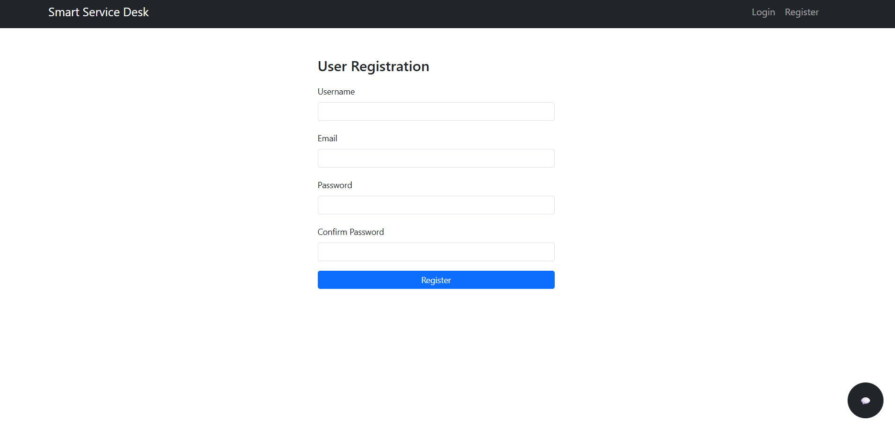

### Login Page

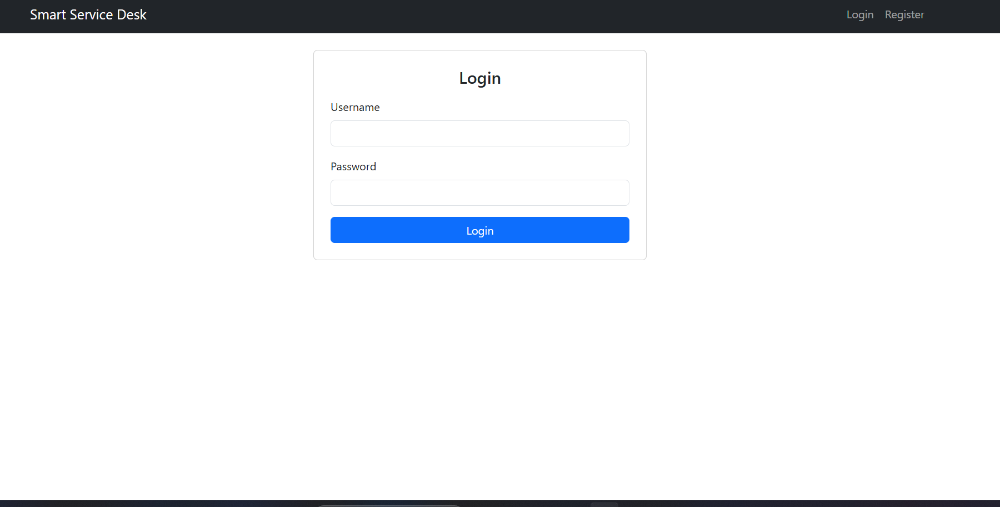

---

## User Interface

### User Dashboard

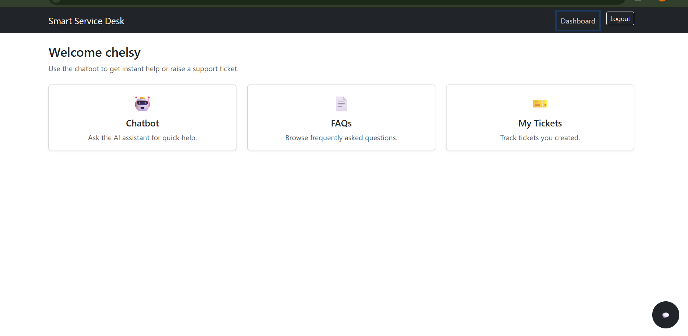

### User Tickets Page

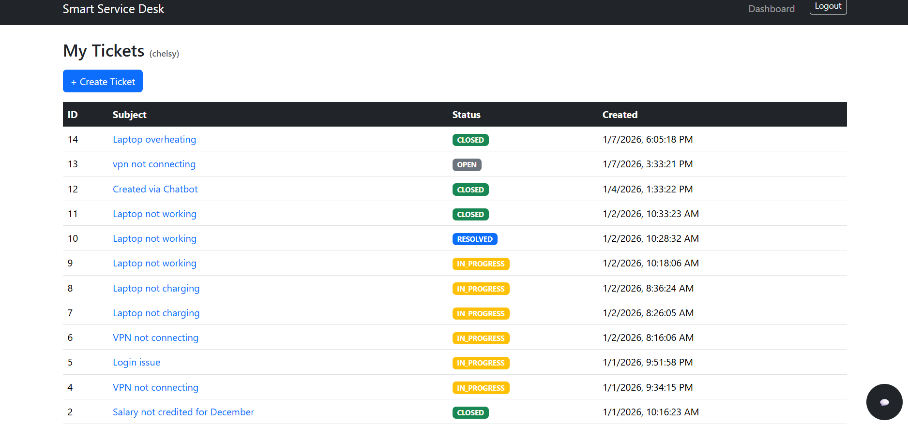

### FAQ Page

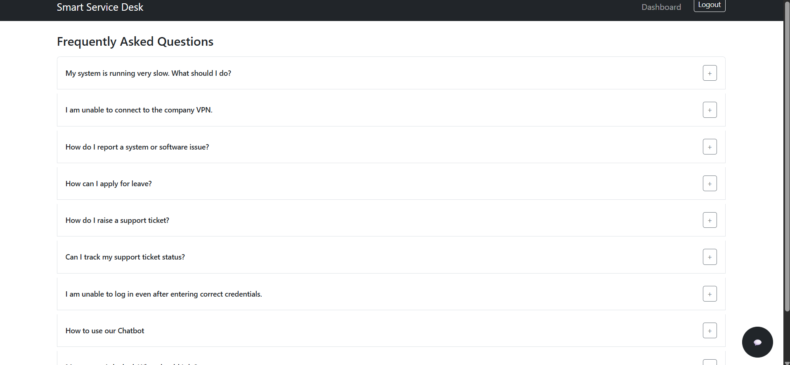

### Chatbot

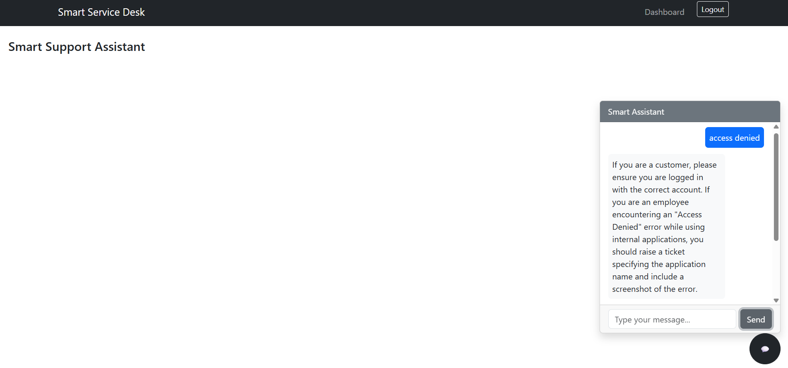

---

## Agent Dashboard

### Agent Dashboard

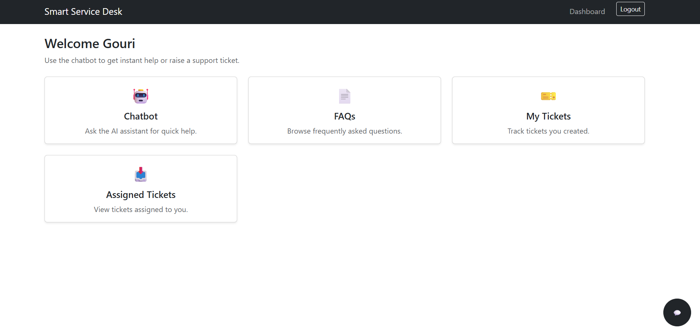

### Assigned Tickets

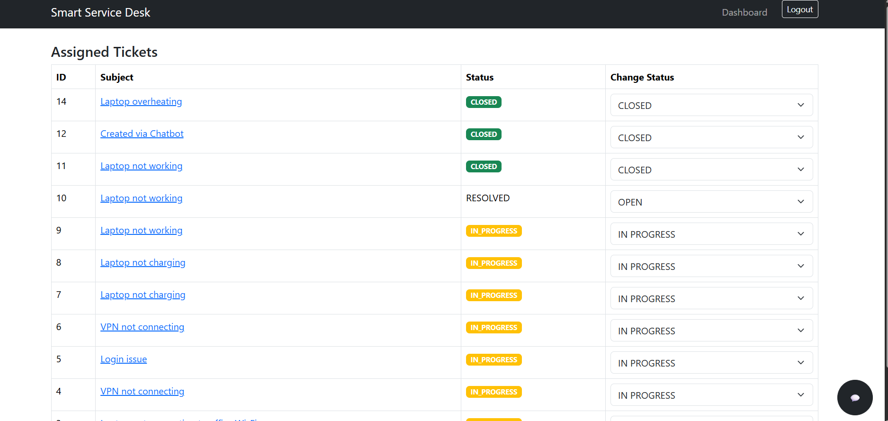

---

## Admin Dashboard

### Admin Dashboard

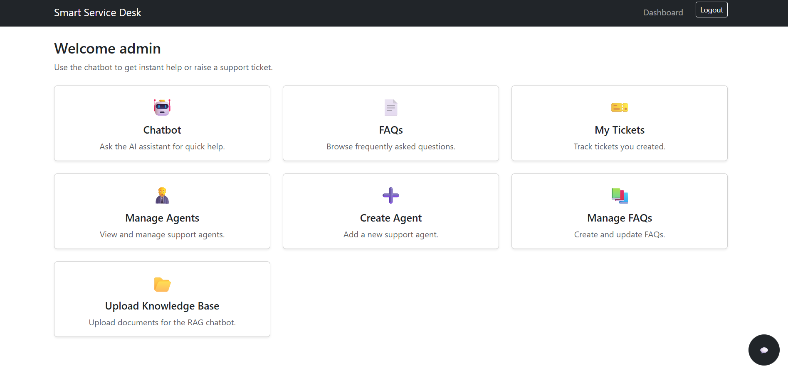

### Manage FAQ

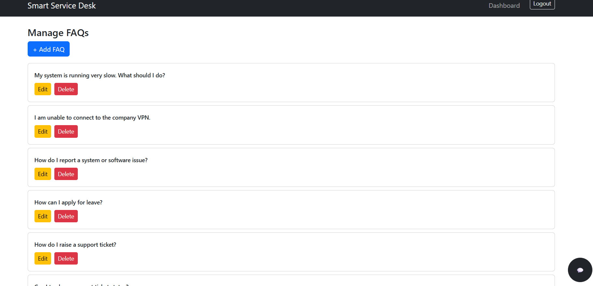

### Create Agent

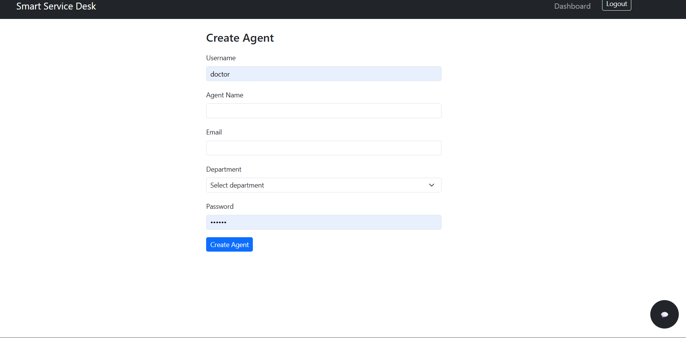

### Manage Agent

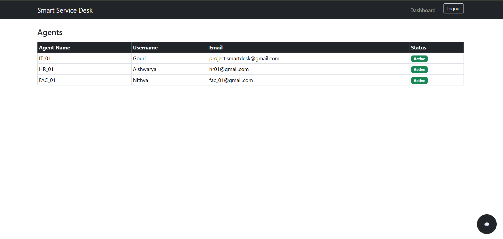

### Upload Knowledge Base

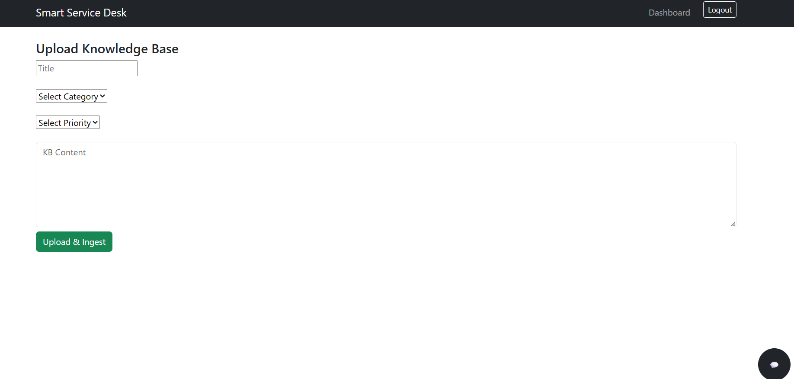

---

# Future Improvements

- Multi-language chatbot support
- Analytics dashboard for ticket insights
- Cloud deployment with CI/CD pipeline

---

# Author

**Chelsy Thomas**  
B.Tech Computer Science and Engineering

---

# License

This project is created for **educational and portfolio purposes**.
